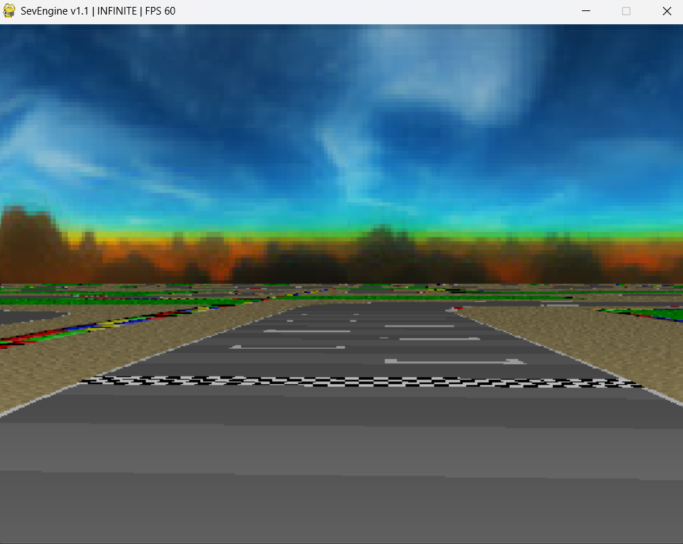
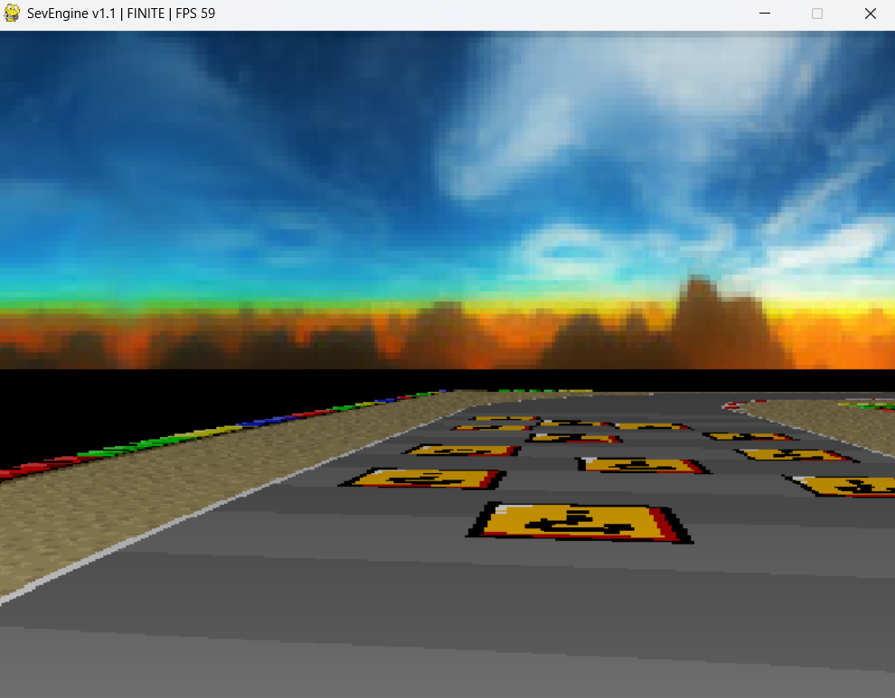
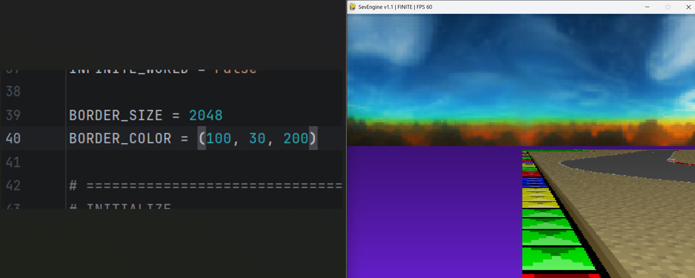

# SevEngine v1.1

Lightweight pseudo-3D / Mode 7 renderer built with Python, Pygame, and NumPy.

SevEngine focuses on simplicity, readability, and experimentation while still achieving fast software-rendered floor projection effects similar to early racing games and retro console hardware.

---

# Features

## Infinite World Rendering
Classic infinitely repeating Mode 7 floor projection.

Perfect for:
- endless racers
- vaporwave scenes
- infinite exploration
- retro-style tech demos

---

## Finite World Mode
Optional bordered world system.

Instead of endlessly tiling the floor texture, SevEngine can generate a finite map surrounded by a configurable colored border.

This creates:
- isolated arenas
- void-style worlds
- map boundaries
- controllable playable spaces

---

## Configurable Border System

Customize:
- border size
- border color
- finite/infinite world mode

Example:

```python
INFINITE_WORLD = False
BORDER_SIZE = 2048
BORDER_COLOR = (0, 0, 0)
```

---

## Dynamic Distance Shading

Floor shading is automatically calculated based on perspective depth.

Creates:
- stronger depth perception
- atmospheric distance fade
- retro rendering aesthetic

---

## Skybox Rendering

Supports panoramic scrolling skyboxes.

Skybox movement is linked directly to camera rotation for convincing pseudo-3D movement.

---

## Numba Optimized Version

Included:
- `main.py`
- `main_numba.py`

The Numba version significantly improves floor rendering performance by compiling the hot render loops to machine code.

### Benefits
- higher render resolutions
- smoother framerates
- better CPU utilization
- larger playable worlds

---

# Screenshots

## Infinite World



---

## Finite World



---

## Border Color Customization



---

# Demo GIFs

## Regular Mode


*main.py*

---

## Optimized Mode (Numba)


*main_numba.py*

---

# Controls

| Key | Action |
|---|---|
| W / Up Arrow | Move Forward |
| S / Down Arrow | Move Backward |
| A / Left Arrow | Rotate Left |
| D / Right Arrow | Rotate Right |

---

# Installation

## Requirements

- Python 3.10+
- Pygame
- NumPy
- Numba (optional for optimized version)

Install dependencies:

```bash
pip install pygame numpy numba
```

---

# Running

## Standard Version

```bash
python main.py
```

## Numba Optimized Version

```bash
python main_numba.py
```

Note:
- first startup of the Numba version may be slower due to JIT compilation
- subsequent execution becomes significantly faster

---

# Project Structure

```text
SevEngine/
│
├── assets/
│   ├── floor.jpg
│   └── skybox.jpg
│
├── screenshots/
│   ├── infinite_world.png
│   ├── finite_world.png
│   └── border_color.png
│
├── gifs/
│   ├── infinite_demo.gif
│   └── finite_demo.gif
│
├── main.py
├── main_numba.py
├── README.md
└── CHANGELOG.md
```

---

# Technical Notes

## Rendering Technique

SevEngine uses:
- floor projection
- perspective depth calculation
- software rendering
- texture-space sampling

This is not raycasting.

Instead, the engine projects a textured floor plane using mathematical perspective calculations.

---

## Finite World Construction

Finite worlds are generated procedurally:

1. create oversized surface
2. fill with border color
3. place floor texture in center
4. sample resulting texture

This avoids modifying original assets.

---

# Current Limitations

SevEngine v1.1 currently does not include:
- wall rendering
- collision system
- sprites/billboards
- height variation
- lighting system
- multiplayer
- audio

These are planned for future versions.

---

# Planned Features

## v1.2 Goals
- border collision
- player hitbox radius
- improved optimization
- cleaner engine structure
- better world-space handling

## Future Ideas
- raycast walls
- billboard sprites
- elevation support
- map editor
- OpenGL renderer
- shader pipeline
- multiplayer experiments

---

# License

MIT License

---

# Credits

Built with:
- Python
- Pygame
- NumPy
- Numba

Inspired by:
- SNES Mode 7
- retro racing games
  - early pseudo-3D renderers