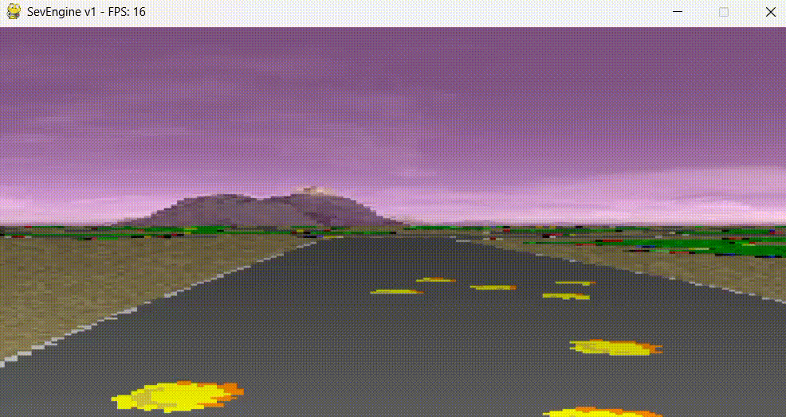
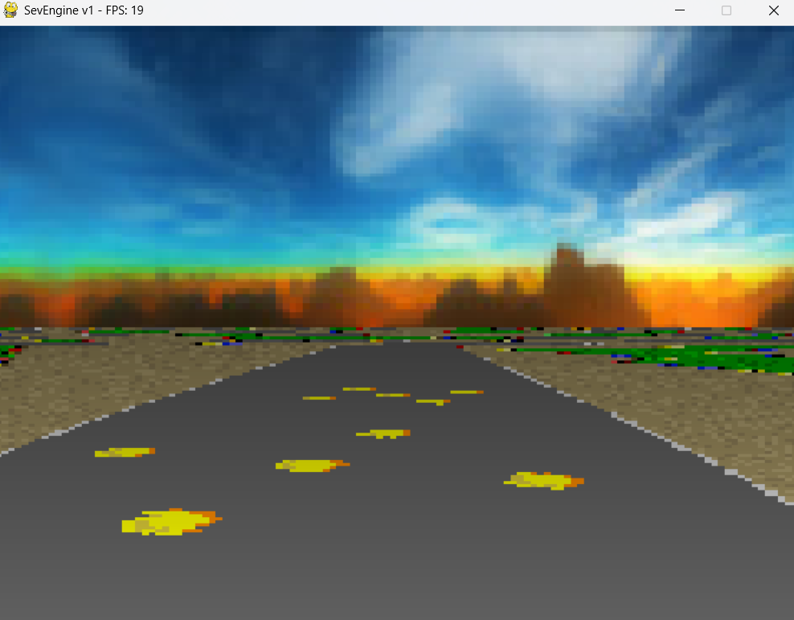

# SevEngine v1

A lightweight Mode 7 / pseudo-3D renderer built with Python, Pygame, and NumPy.

## Demo

---

## Screenshot

---

## What is Mode 7?

Mode 7 is a classic pseudo-3D rendering technique popularized by the Super Nintendo (SNES).

Instead of true 3D geometry, it creates the illusion of depth by:
- Scaling and rotating a flat 2D texture
- Applying perspective distortion
- Rendering the world from a camera viewpoint

This technique was famously used in games like:
- F-Zero
- Super Mario Kart

---

## What is SevEngine for?

SevEngine is a lightweight Python implementation of a Mode 7 renderer designed for:
- Learning pseudo-3D graphics programming
- Experimenting with rendering techniques
- Building retro-style racing or exploration games
- Understanding perspective math and texture projection
- Serving as a foundation for larger rendering engines

**SevEngine IS NOT meant to be a video game. It is a lightweight renderer engine for creating Mode 7 video games.**

---

## Features

- Infinite tiled floor rendering
- Skybox rendering
- Adjustable field of view
- Distance shading
- Lightweight and beginner-friendly (one file)
- Real-time movement system
- Fully written in Python
- **Fully customizable** (use your own assets and settings or use the default ones)

---

## Controls

| Key | Action |
|---|---|
| W / Up Arrow | Move forward |
| S / Down Arrow | Move backward |
| A / Left Arrow | Rotate left |
| D / Right Arrow | Rotate right |
